## Introduction

2PyBot is a self-balancing two-wheeled robot. The kind where if the firmware isn't running, it just falls over.

It started as a straightforward robotics project, get it to balance. But the further it went, the deeper it got. Sensor fusion, custom stepper drivers, wireless control, a Python desktop dashboard, hardware timer interrupts. What began as a simple experiment turned into a fully documented, actively developed platform.

The whole thing runs on an ESP32. Stepper motors for actuation. A 6-axis IMU fused through a Mahony AHRS filter for orientation. An ESP-NOW wireless link to a custom-built joystick transmitter. And a Python GUI for live telemetry and PID tuning over Bluetooth.

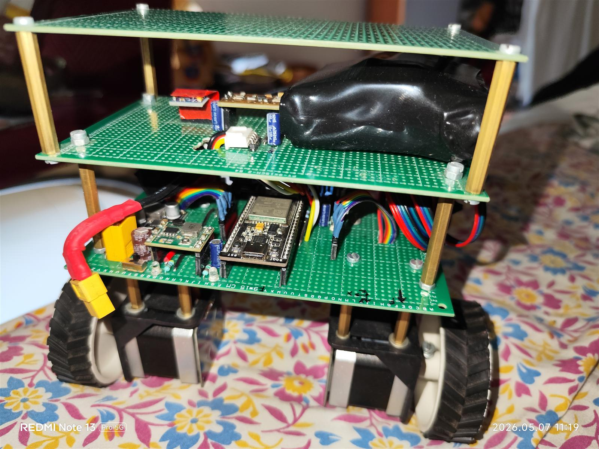

---

## Demo

<div class="image-row">
  <video width="50%" controls>
    <source src="../../assets/projects/2pybot/VID_20260509_164352.mp4" type="video/mp4">
  </video>
  <video width="50%" controls>
    <source src="../../assets/projects/2pybot/VID_20260418_030658.mp4" type="video/mp4">
  </video>
</div>

---

## The Hardware

### Motion: NEMA17 Steppers + TMC2208 Drivers

Stepper motors were chosen over DC motors for one specific reason: they give deterministic, precise control over position and speed. There is no encoder needed. You send steps, you get steps.

The TMC2208 drivers run in UART mode, which means microstepping configuration, current limits, and motor diagnostics all happen over a single serial line. Silent stepping also means the bot isn't annoyingly loud when it's just sitting there balancing.

The drivers are pushed by a **20kHz hardware timer ISR** on the ESP32. Standard loop-based step generation was tried first and it caused jitter, the CPU's interrupt latency from the main loop was enough to mess with step timing at higher speeds. Moving the pulse generation into IRAM-resident timer interrupts fixed it completely. The motors went from jittery and noisy to smooth and precise.

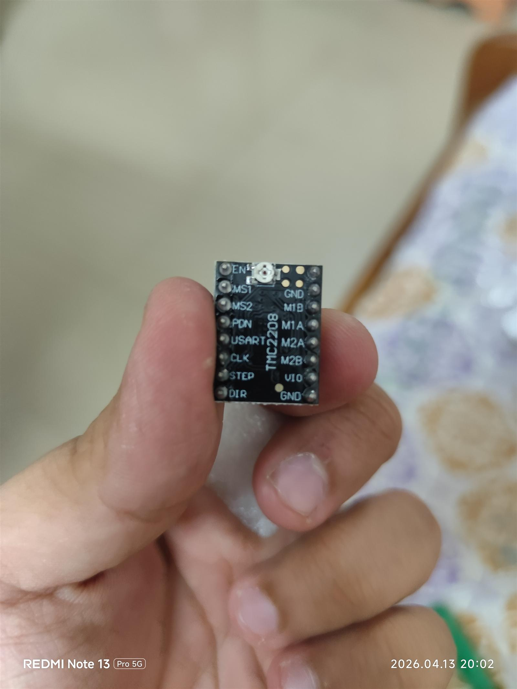

### Sensing: ISM6HG256X IMU + QMC5883L Magnetometer

The IMU is the ISM6HG256X (ISM330DHCX family from STMicroelectronics). Same sensor used in the IMU Sensor Board project. It talks over I2C at 400kHz.

Raw IMU data alone isn't enough to balance. Accelerometer readings are noisy and react to vibration. Gyroscope readings drift over time. The solution is sensor fusion.

The firmware uses a **Mahony AHRS filter**, it blends accelerometer and gyroscope data and produces a stable, drift-compensated pitch angle. That pitch angle is what the PID controller actually acts on.

The QMC5883L magnetometer adds a tilt-compensated heading estimate for yaw control. When you want the robot to hold a heading or steer, the heading error feeds into a separate PID loop.

### Wireless: ESP-NOW Joystick

The controller is a second ESP32 in a handheld unit. It sends joystick values over **ESP-NOW**, which is a peer-to-peer WiFi protocol from Espressif. No router, no TCP stack, no latency from DHCP or connection handshaking. Just direct packet transmission with around 1-2ms latency.

On the robot side, received joystick values adjust the balance setpoint (lean forward to move forward) and the yaw target (turn left, turn right).

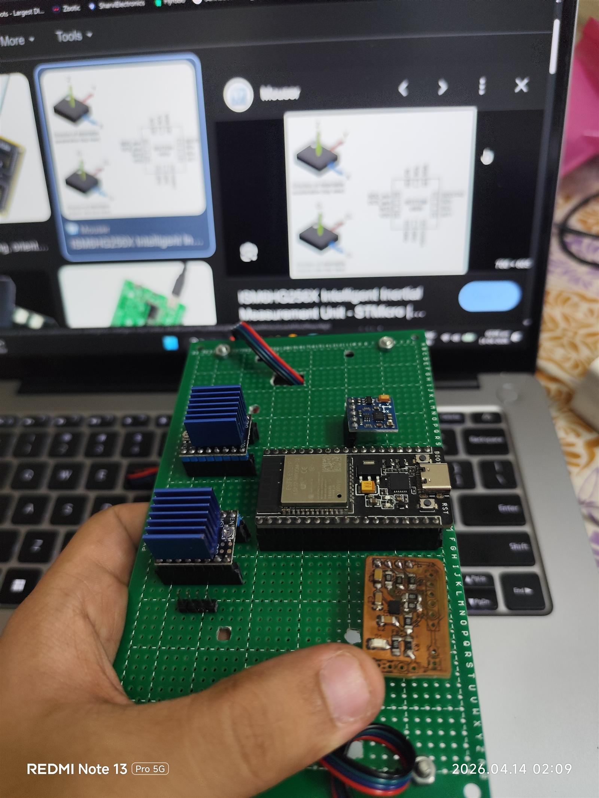

---

## Build Process

The chassis uses a 3-tier perfboard stack mounted on NEMA17 motor brackets. First iteration was a quick proof of concept to get the sensors and drivers talking. The frame went through a few revisions before reaching this layout.

<div class="image-grid">

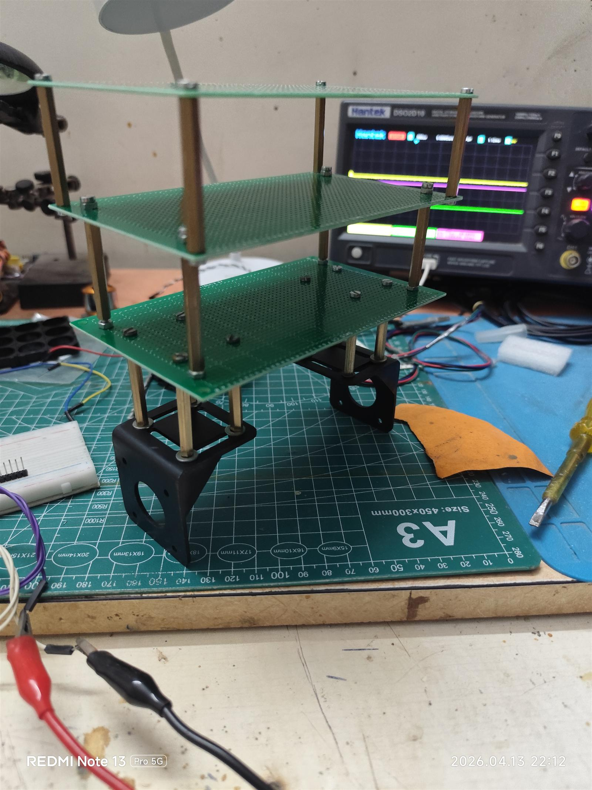

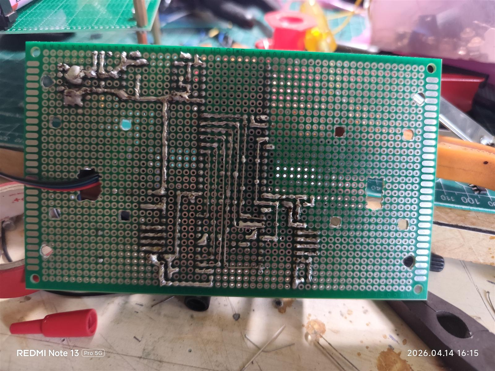

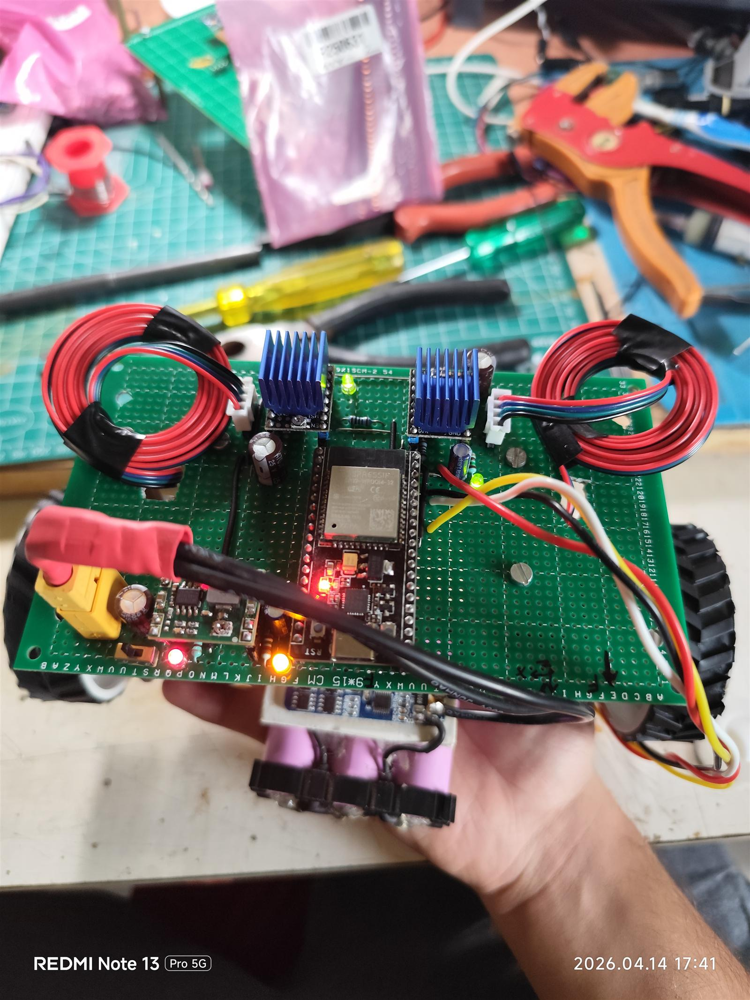

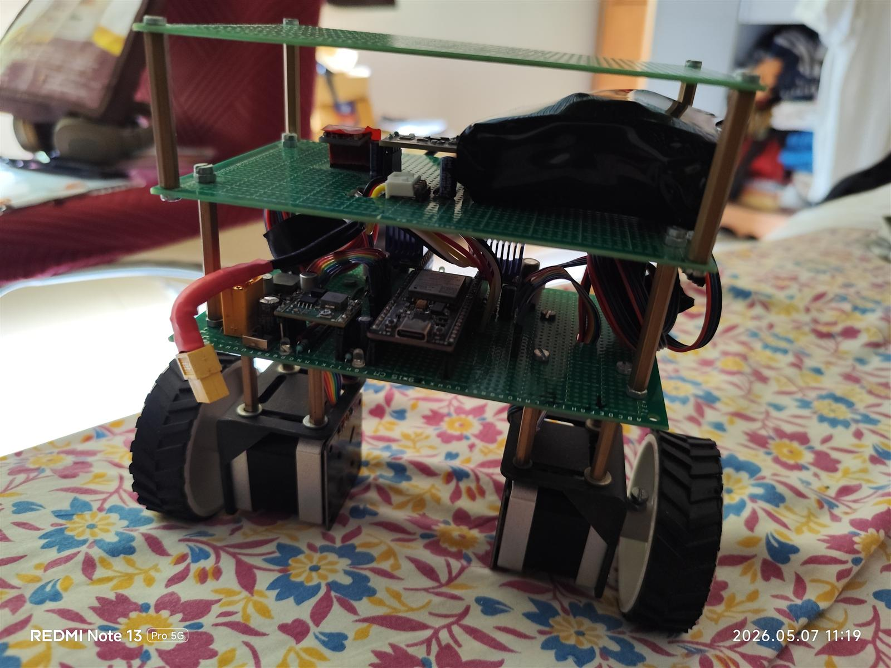

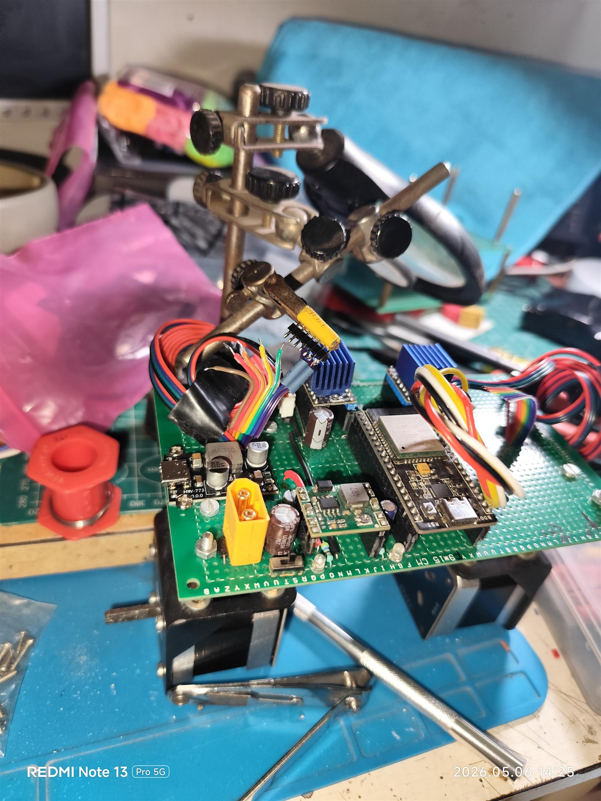

</div>

---

## The Firmware

Everything runs at **200Hz**. Every 5ms, the main loop:

1. Reads the IMU and runs the Mahony filter to get the current pitch angle
2. Checks for incoming ESP-NOW packets from the joystick
3. Computes the balance PID output
4. Computes the yaw PID output
5. Mixes both outputs into left/right wheel speeds
6. Sends those speeds to the stepper ISR

The control loop is tight and deterministic. Nothing that takes an unpredictable amount of time runs in the main loop.

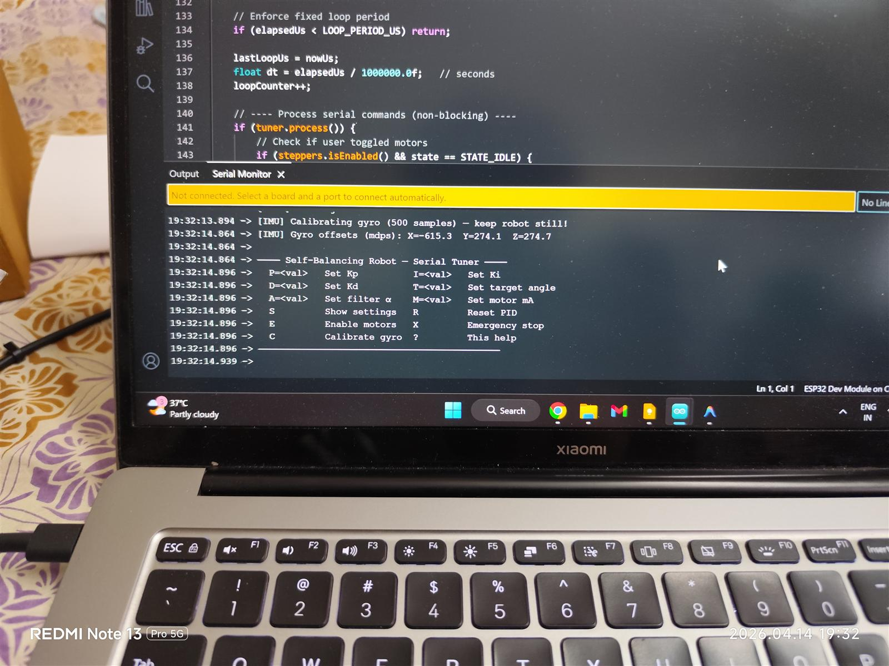

### The Balance PID

The robot is fundamentally an inverted pendulum. It falls in the direction it tilts, and the wheels have to chase it faster than it can fall.

The PID equation:

```
Output = P × θ_err + I × ∫θ_err dt + D × (−dθ_measured/dt)
```

One detail worth explaining: the derivative term is computed on the **measured angle**, not the error. This is deliberate.

If the derivative were computed on the error, then every time you change the setpoint (like pushing the joystick forward), the sudden jump in error would produce a huge derivative spike and the robot would thrash violently. By differentiating the measured angle instead, setpoint changes don't affect the derivative at all. Only actual physical motion does.

The derivative output is also filtered with a cascaded EMA to reduce high-frequency IMU noise from getting amplified.

### Cascaded PID

There are actually three PID loops running:

- **Balance PID** , controls pitch angle to stay upright
- **Position PID** , integrates velocity to estimate position and applies a slow corrective lean to prevent drift
- **Yaw PID** , controls heading using the magnetometer and applies a speed differential between left and right wheels to steer

The outputs cascade. Position PID feeds a target offset into the balance PID. Yaw PID generates a speed differential that gets mixed with the base speed from balance PID. The stepper ISR receives final left/right step rates.

---

## The Python Dashboard

There is a desktop GUI written in Python that connects over Bluetooth serial.

It shows:

- Live pitch angle over time
- Motor speed (steps per second, left and right)
- PID output
- Current P, I, D values

And it can inject new PID gains live, without stopping the robot or reflashing firmware. You type in a new Kp, hit send, and the robot immediately starts responding differently. This makes tuning actually manageable.

The Bluetooth interface uses the same text-based command format as the web-based tuner, commands like `P=120.0`, `I=0.5`, `D=8.0`, `E` to enable, `X` to disable.

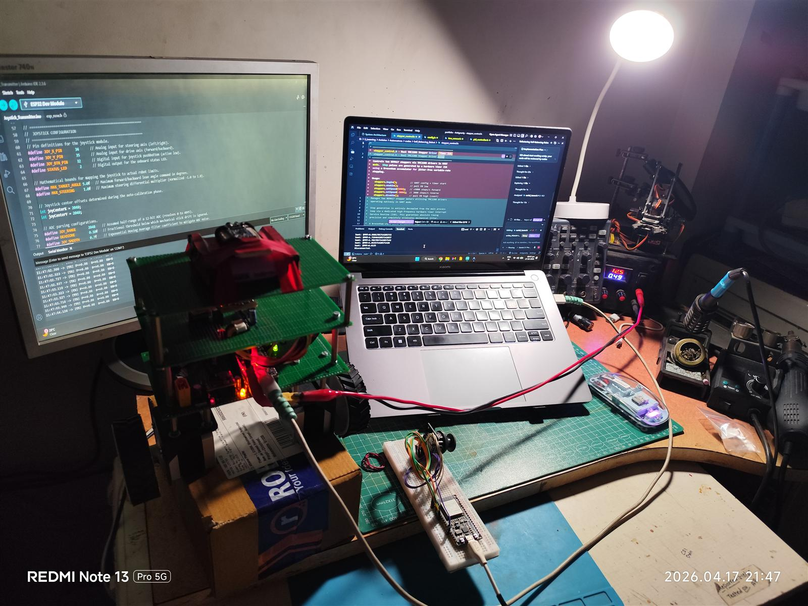

---

## Tuning It

Getting a self-balancing robot stable is not trivial. Here is roughly how the tuning process goes:

**Step 1 , Find Kp.** Set I and D to zero. Ramp up Kp until the robot oscillates at a steady, high-frequency wobble. Back it off about 15%. That is your proportional baseline.

**Step 2 , Add Kd.** Introduce a small derivative gain. This damps the oscillation. Keep going up until disturbances get rejected quickly without introducing shivering. Too much Kd and high-frequency IMU noise gets amplified into motor vibration.

**Step 3 , Add Ki.** A small integral term handles steady-state lean caused by battery position, cable routing, or chassis asymmetry. Too much and the robot starts slow oscillations that are hard to recover from.

**Step 4 , Find the balance angle.** `DEFAULT_TARGET_ANGLE` in config.h is the actual physical tilt where the robot considers itself upright. This is not zero. It depends on where the battery and heavy components sit. Finding this requires holding the robot at the angle where it runs straight and reading the IMU output.

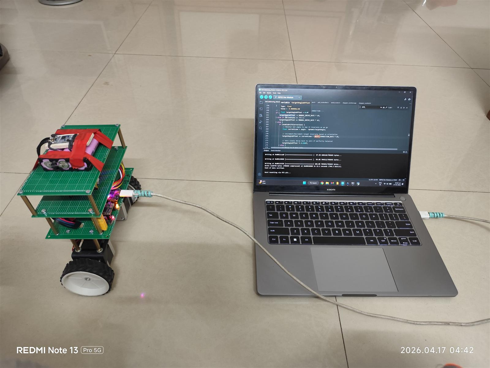

<div class="image-row">
  <video width="50%" controls>
    <source src="../../assets/projects/2pybot/VID_20260415_141130.mp4" type="video/mp4">
  </video>
  <video width="50%" controls>
    <source src="../../assets/projects/2pybot/VID_20260418_030219.mp4" type="video/mp4">
  </video>
</div>

---

## Project Structure

```
2PyBot/
├── firmware/
│   ├── BaseLink/         Robot (receiver) firmware
│   └── Controller/       Joystick transmitter firmware
├── gui/                  Python desktop dashboard
├── hardware/             PCB schematics and BOM (KiCad)
├── models/               3D CAD files (STEP, GLB)
├── assets/               Photos, demo videos, renders
└── docs/
    ├── BaseLink/         Full robot-side documentation
    └── Controller/       Transmitter-side documentation
```

---

## Current Status

- Firmware: Active development
- Balance loop: Stable
- Yaw control: Working
- Python GUI: Functional with live PID injection
- Joystick transmitter: Working over ESP-NOW
- PCB: In KiCad, hardware design in progress
- Documentation: Being written alongside development

The robot balances and responds to joystick input. Active tuning and refinement is ongoing.

---

## What's Next

- Finalize and fab the custom PCB to replace the breadboard/perfboard prototype
- Implement position hold with better drift correction
- Add an accelerometer-based fall detection and safe shutdown
- Try sensorless yaw estimation using only the IMU (drop the magnetometer)
- Write a firmware calibration routine to auto-measure the balance angle on startup

---

## Links

- [GitHub Repository](https://github.com/atharvap8/2PyBot)
