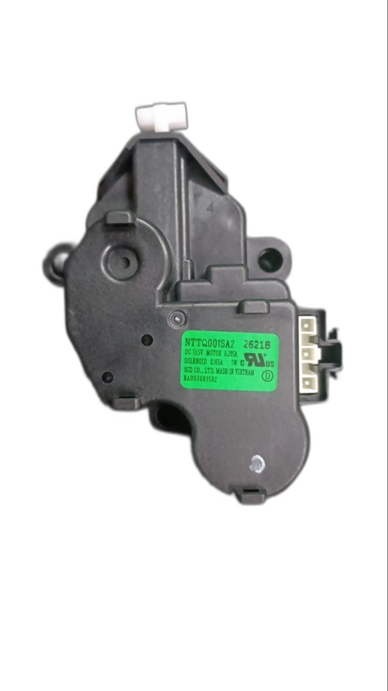
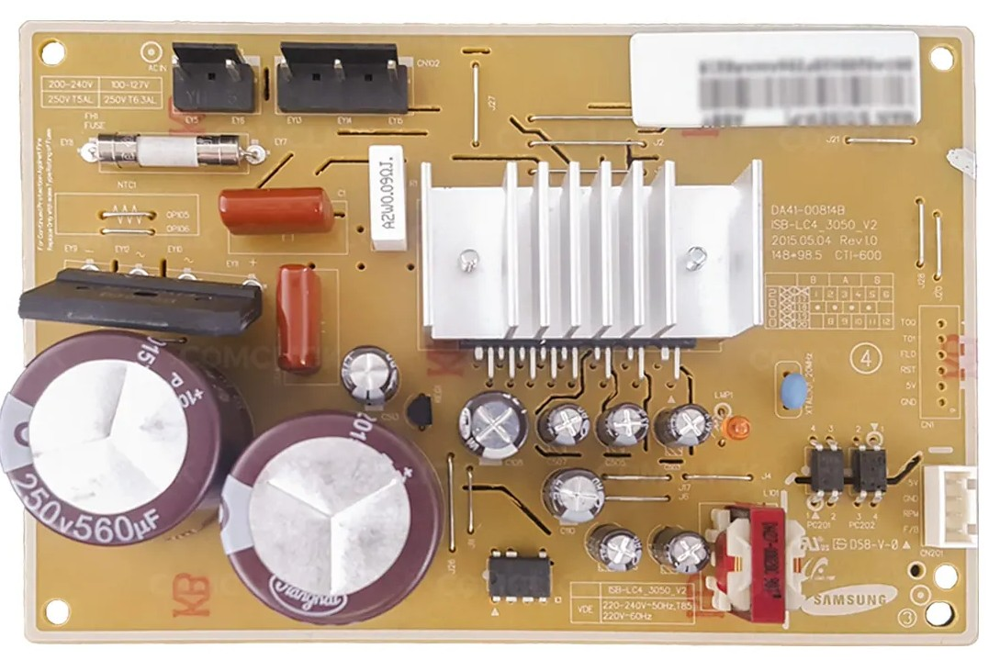
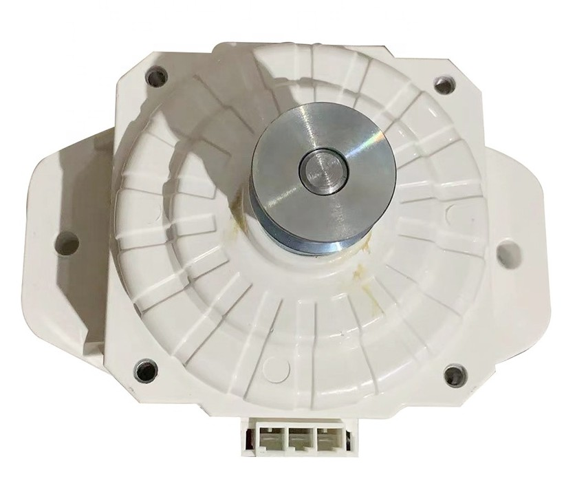
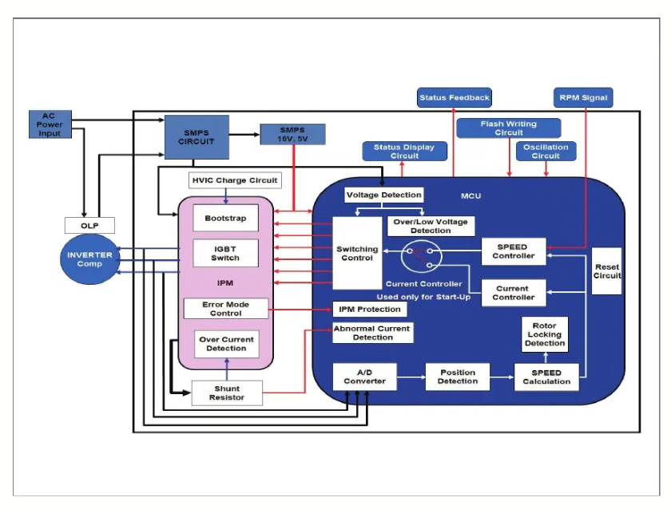
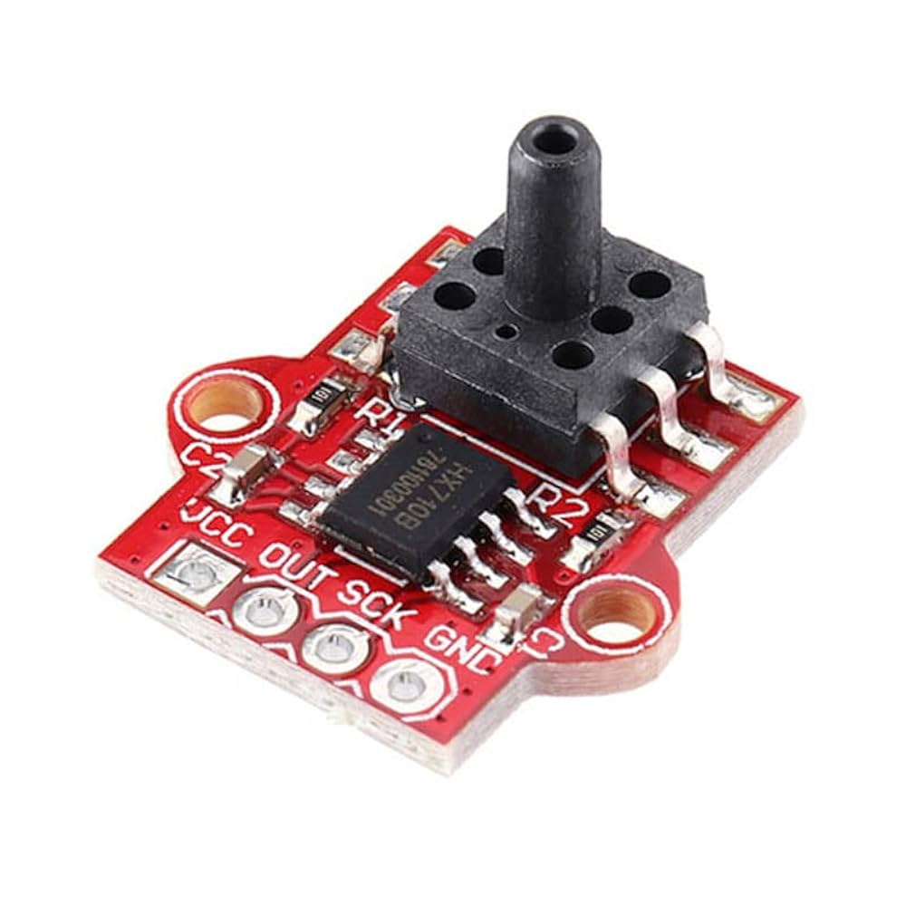

## 📘 Introduction
This project documents the transformation of a non-functional LG fully automatic washing machine into a modern, intelligent, and voice-controlled appliance using ESP32 microcontroller, relays, sensors, and Alexa integration. The machine’s original controller PCB had failed, providing an opportunity to take full control of the machine’s sophisticated components and create a customisable system from the ground up.

## 🎯 Background & Motivation
After the machine’s original controller board went haywire, instead of discarding it, I saw the opportunity to understand and reengineer the device. With full access to all internal components (motor, valves, sensors), this project became an intensive 1-year journey through reverse engineering, signal probing, embedded firmware design, IoT integration, mechanical testing, and finally full automation.

## 🔧 Complete Disassembly & Mechanical Understanding
- First I started by taking the entire drum and motor assembly apart. I literally removed every component and part, such as the suspension arms, The Drain Motor assembly, the gearbox transmission system, The motor assembly.
- The top cover was removed, and the required wiring connectors were disconnected, so as to completely separate the top housing cover. Then the drum assembly was taken out.
- What I did afterwards is, I had a 3 phase VFD (Variable Frequency Drive). Using it, I started to test the motor with various frequecies, and observed the RPM of the motor at different frequency.
- Next test was to properly test if the drum brake disengage mechanism was working or not. To test it, I had to apply 12 V to the drain Motor. There i realized, it had 3 pins, 1 is GND (Ground), 2 is Wash Mode, 3 is Spin Mode.
- By applying 12V DC to specified terminal, i tested the drain motor. And confirmed that the drum also starts to spin.



## 🧠 Reverse Engineering the Inverter Drive Module
### Inverter Drive Module (Model: ISB-LC4-3050_V2)


- Before connecting the module to anything, I conducted a thorough short-circuit and continuity test on the IPM board to ensure that it hadn’t suffered damage or latent failures. Only after verifying its integrity did I proceed with functional testing.
- The inverter module contains an Infineon IGCM04G60HA Intelligent Power Module ([IPM](https://eepower.com/technical-articles/intelligent-power-modules-ipms-concepts-features-and-applications)) along with a Renesas UPD78F1201 16-bit microcontroller, originally used in Samsung dual-door refrigerators to control the BLDC compressor motor.
- I began reverse engineering the control logic by tracing the input terminals and signal paths on the board. It was quickly evident that this module was far more sophisticated than a basic relay driver — it had full embedded PWM-based motor control logic built into the microcontroller.
- The IPM requires an external 325V DC power rail, typically obtained by rectifying and filtering the 230V AC mains using a high-voltage bridge rectifier and bulk electrolytic capacitors. This high-voltage rail is then switched across the motor windings using high-side and low-side IGBTs inside the IPM, forming a standard three-phase inverter topology.
- One of the unique behaviors I discovered during testing was the module’s built-in soft-start delay: it waits for nearly 10 minutes after power is applied before automatically enabling motor output. This likely replicates the refrigeration compressor’s anti-short-cycling feature. After the wait, the board autonomously initialized and began spinning the motor, confirming that it was operational.
- During this process, I connected the motor externally and used a series filament lamp to limit inrush current and provide a visual cue for abnormal current draw — a tried-and-tested method in electronics repair. This prevented catastrophic failure in case of internal shorts or miswiring.
- The motor began spinning smoothly with considerable torque — to the extent that I could not stop it by hand. The board was operating as expected, safely handling the start-up, speed regulation, and directional switching.

## ⚙️ Understanding Motor Drive Logic (3-Phase Inverter Motor)
- The motor was a typical 3-Phase UVW Motor, with a rated Voltage of 310V DC. Also it was specially designed for LG.
BLDC Motor - (Part No. WDC0150Y1M)
- Once the motor was verified to run standalone, I mounted it inside the washing machine drum and connected it to the mechanical assembly responsible for spin and wash motion. This allowed me to testing realistic load behavior.
- I loaded the drum with wet clothes and triggered a spin sequence. The motor was powerful enough to sustain the load without stalling — demonstrating that the Samsung IPM board’s output stage was capable of delivering commercial-level torque, even under load conditions typical for a full spin cycle.
- I studied the motor’s feedback and control wiring in more detail. It used a 4-pin connector, responsible for:
    - Providing Motor RPM (Speed) Values (using Feedback)
    - Providing PWM Speed Control to the IPM board
    - Sending Fault Status and Response Codes
- The core of the operation lies in the alternating high-voltage switching of the three-phase windings, based on precise rotor position sensing. This allows the motor to operate in synchronous mode, with smooth startup, speed variation, and directional control.





## 🧪 Prototyping with Arduino UNO
- To test manual control over the IPM board, I designed a basic PWM signal generator using an Arduino UNO. The idea was to simulate the kind of PWM signals the original fridge controller might have sent to the IPM board.
Video Link: [Click Here](https://photos.google.com/share/AF1QipPNWp27gQstlgL91O9z6UTNsfqDp0jNiJFLL1oh2fxKv0CKhDPo4cSU1hQcb7W5Ug/photo/AF1QipNVxxiq89uGjgkWxa-xYKltjGWV_kP-2nztHGkK?key=WE9fbWNub0hjMVVGcDI5YVAwNG5lRzgwblA3Qm1B)
- The PWM signal was routed through an optocoupler to safely interface the 5V Arduino with the IPM’s control logic. This allowed me to control motor start/stop by sending short PWM bursts after the initial soft-start period.
- Next, I experimented with variable PWM duty cycles and frequency modulation. This helped test the motor speed control behavior — I could observe changes in spin RPM as I adjusted the duty cycle from ~20% to ~90%.
- This step confirmed that the motor’s speed could be externally controlled via software-generated PWM, laying the groundwork for future integration with the ESP32, which would replace the Arduino in the final system.
- The prototype circuit also included simple time delay routines to prevent sudden starts, giving the inverter enough time to safely initialize before sending control signals.

## 🔌 Actuator Testing & Verification
- To ensure that each electromechanical component of the washing machine functioned independently and predictably, I began by testing the actuators one by one using a bench power supply set to 12V DC. This direct testing allowed me to characterize their behavior under controlled conditions.
- **Inlet Valve Solenoid**: Applying 12V to the inlet valve triggered the internal solenoid, allowing water to flow through the valve — confirming its normal operation. This validated that the solenoid did not have internal clogs or sticking.
Test Video: [Click Here](https://photos.google.com/share/AF1QipPNWp27gQstlgL91O9z6UTNsfqDp0jNiJFLL1oh2fxKv0CKhDPo4cSU1hQcb7W5Ug/photo/AF1QipNyLZyQe0GKYjuD5GXr5bdJehANY0eZp5mWon2a?key=WE9fbWNub0hjMVVGcDI5YVAwNG5lRzgwblA3Qm1B)
- **Drain Motor – Stage 1 (Power Wash Mode)**: In this stage, a partial stroke of the drain motor disengages the half-drum brake, enabling gentle rotation for washing. On applying power, the actuator moved correctly to this intermediate position.
- **Drain Motor – Stage 2 (Spin Mode)**: A longer actuation engaged the drain motor fully, which completely disengaged the drum brake, allowing high-speed rotation for spin cycles. This also worked reliably and repeatedly.

## 🔄 Closed-Loop Water Level Regulation
To automate water level management, I initially explored both analog and digital pressure sensing techniques. While analog sensors lacked precision and required additional ADC circuitry, most commercial digital pressure sensors were expensive and difficult to source.
- After some research, I discovered the **HX710B**, a pressure sensor IC derived from the popular HX711 load cell amplifier family. Though not originally intended for environmental sensing, the HX710B has a differential ADC interface capable of measuring small voltage differences with high resolution — making it suitable for repurposing as a water-level pressure sensor.
### Test Setup:
- I connected the HX710B to a small air trap chamber — this chamber is connected to the bottom of the drum via a sealed air tube.
- As the water fills the drum, the air inside the trap compresses, increasing the internal pressure, which is detected by the HX710B module.
- A simple Arduino sketch continuously read the digital values from the HX710B and compared them against predefined setpoints.
- Calibration was performed manually using graduated containers to add specific volumes of water. I logged corresponding sensor readings to correlate digital values with actual water levels (e.g., 6L, 12L, 18L).



## 🔁 Transitioning to ESP32 Platform
- Once the core testing of motor control and actuator behavior was completed, I shifted focus to building a more intelligent, fully programmable controller. This began with selecting the appropriate microcontroller platform.
### Microcontroller Selection:
- After estimating the number of GPIOs required for relay modules, sensors, communication interfaces, and feedback mechanisms, I finalized the **ESP32** as the brain of the system.
The ESP32 provided:
- Dual-core processing for multitasking wash logic and communications.
- Sufficient digital I/O and ADC inputs.
- Built-in Wi-Fi and Bluetooth, enabling smart integration features.
### Platform Setup and Firmware Development:
- I opted for the **ESP-IDF** (Espressif IoT Development Framework) to build the firmware, ensuring full control and lower-level access compared to Arduino Core.
### Initial libraries integrated:
- HX711/HX710B for water level sensing.
- Telegram Bot Library to push real-time updates to my personal Telegram bot.
- Wire / I2C / GPIO drivers for low-level control of peripherals.
- WebServer Library for Endpoint control, and OTA Update Framework.
- ElegantOTA Library for Backend OTA Handling.
- LiquidCrystalI2C Library for Displaying text on 16x2 LCD.
- Espalexa Library for Remote Device Control.
- All control logic — including PWM generation, relay sequencing, safety interlocks, and mode switching — was implemented as tasks within the ESP32’s FreeRTOS framework.

## 🧱 Mechanical Load Testing
- With firmware ready and control logic functional, I moved on to real-world mechanical stress testing to validate the full load capabilities of the inverter drive and the motor.
### ⚙️ Full Drum Load Testing:
- I mounted the motor inside the washing drum, reassembled the mechanical linkage, and filled the drum with clothes and water to simulate real conditions.
- Using different PWM duty cycles, I controlled the motor through wash, rinse, and spin modes.
- Peak power output observed was approximately 350W sustained, with startup torque high enough that manual interruption was impossible — indicating the IPM was operating optimally.
### 🚨 Error Handling Observations:
- During testing, unexpected shutdowns occurred. After careful diagnosis, I discovered a protection feature in the inverter module:
- If a single changeover relay (used for phase reversal) was left ON while the inverter supply was active, the UVW outputs got shorted.
- This triggered the IPM’s internal short-circuit protection (OCP), causing the module to shut down.
- I updated the code logic to ensure relays disengage cleanly before power-down, preventing inadvertent fault conditions.

## 🧯 Custom PCB Design & Wiring Integration
Once the electronics and code were verified on breadboards and modules, I moved to permanent installation inside the washing machine.
### Hardware Design and Assembly:
Created a detailed schematic, including:
- Relay driver modules
- Isolated optocoupler inputs for IPM signals
- Buck converters for powering logic
- Sensor headers for HX710B, inlet valve, and drain motor
- Due to unavailability of quick-turn PCB fabrication services, I hand-built the board on a general-purpose zero PCB, following the schematic.
### Testing & Installation:
- All components were tested during assembly to ensure there were no solder bridges or open circuits.
- I labeled each wire and crimped all terminal ends to ensure proper fit inside screw terminals.
- Cutouts and holes were drilled into the top cover panel and a side-mounted junction box was added to house the control PCB safely.
### Wiring Scheme:
- 3 motor wires:
    - 1 directly connected to the motor
    - 2 routed through changeover relays to switch phases
- 2 wires to inverter drive:
    - Live (through relay NO + COM terminals)
    - Neutral (direct to inverter drive)
- Remaining relay channels controlled:
    - Drain Motor Stage 1
    - Drain Motor Stage 2
    - Inlet Valve
    - Changeover Relays
- For detailed wiring and notes, refer the schematic circuit diagram, and stock wiring diagram of the machine.

## 🎛️ Front Panel Design & Development
Designing the front panel was not just an aesthetic decision — it was a critical component in delivering a functional, reliable, and user-friendly interface for the retrofitted washing machine. With no original UI board functioning (due to the faulty LG controller), the entire interface had to be redesigned from scratch, keeping in mind ergonomics, electrical isolation, display clarity, and accessibility.
### 🧱 1. Layout Planning
The design process started with a rough sketch of all the necessary interface elements:
- Main display (LCD 16x2 or OLED).
- Tactile input buttons (Mode, Start, Reset).
- LED indicators for system states.
- Emergency stop provision.
- Access ports for OTA/Debug (e.g., USB/FTDI header)
- Cutouts for ventilation and labeling.
### 🧩 2. Component Selection & Positioning
Each panel component was chosen based on usability and reliability:
- Tactile Push Buttons Easy to mount, long life, ideal for mode switching.
- 16x2 LCD Display Cost-effective, clear status updates.
- Status LEDs For real-time visual feedback: power, mode, error, operation.
- Panel-Mount Connectors For 5V DC input, USB debug, and potential serial interfaces.
All components were mounted on a common plastic/acrylic sheet, which was cut and drilled manually to fit each device precisely.
### 🧷 3. Wiring & Assembly
Behind the front panel:
- All button presses were connected via pull-down resistors to GPIOs.
- LEDs were driven using current-limiting resistors and GPIOs.
- Display was connected via I2C (SCL/SDA), allowing minimal pin usage.
- Proper strain reliefs and wire harnessing were added to avoid accidental disconnections.
Each wire was labeled and color-coded. Terminal blocks or screw connectors were used where possible, ensuring modularity during maintenance or updates.
### 🧰 4. Enclosure Integration
The final panel was:
- Mounted on the side wall of the washing machine (junction box style).
- Designed for easy access even while machine was running.
- Provided with ventilation slots to prevent overheating of onboard electronics.
- Screwed and sealed to prevent accidental contact with internal high-voltage parts.
### 📟 5. Display Logic
The UI logic was written in ESP32 firmware:
- Idle screen shows “Please Select A Program”
- Active screen scrolls between:
    - Current mode.
    - Water level.
    - Time remaining.
    - Error/warning messages.
- Error conditions trigger blinking patterns and special alerts.
### 🧪 6. Testing & Feedback
After panel assembly:
- Every button and LED was tested individually for debounce behavior.
- Display visibility was checked under different lighting conditions.
- Labels were added using sticker paper or engraved plate to show functions clearly.
- Final touch: Added support for firmware OTA updates through a physical button combo.

## ✅ Implemented Features
- Basic Washing Programs
- Water Level Sensing
- Wi-Fi Enabled Control
- Live Status Indication
- Voice Assistant Integration
- Web Dashboard Control
- OTA Firmware Update
- Partial Error Handling
- Manual Control Panel
- Status LEDs
- Telegram Notification Bot
- LCD Display Feedback

## 🛠️ Features Under Development
- Countdown Timer Display
- Emergency Inverter Stop
- Custom IC-Based PCB Design
- Custom Inverter Drive Design
- Wash Cycle Memory Function
- Auto Resume After Power Loss
- Door Safety Interrupt
- Load Sensing & Auto Balancing
- Smart Error Diagnosis & Suggestions
- AI Self-Diagnostic System
- Test Mode (Self-Run)
- AI-Based Laundry Type Detection
- Dynamic Water Level by Load
- Water Heater & Temperature Sensing

## ⚠️ Challenges & Failures
1. **Understanding the Inverter Drive — Blind Reverse Engineering**
At the start, the inverter module (Samsung ISB-LC4-3050_V2) was a black box. No schematics, no documentation, no datasheets. Just a 325V input and a four-pin connector to a washing machine motor. Through painstaking trial and error, I reverse-engineered:
- The function of feedback pins.
- How the module self-starts after a 10-minute delay.
- How it interprets PWM signals for speed control.
This eventually led to block diagrams, signal maps, and logic sequences that were key to system integration.
2. **Motor Direction and Speed Control**
Getting the motor to spin wasn’t enough. Controlling its direction and speed was the next major challenge.
- Direction control required safe relay-based phase inversion.
- Speed control required precise PWM signal timing.
I went through dozens of PWM timing experiments, finally landing on a sweet spot that gave the motor smooth acceleration without tripping inverter protections.
3. **Water Level Control Loop Failures**
The HX710B sensor used for measuring drum pressure occasionally gave erratic or drifting values, which caused:
- Preemptive termination of water fill.
- Overfilling with no cutoff.
I solved this by:
- Stabilizing digital readings.
- Averaging the values across multiple samples.
- Introducing double-threshold hysteresis logic to avoid rapid toggling.
4. **Relay Changeover Interference with IPM**
The changeover relays used to reverse motor direction were affecting the IPM drive. During relay switching, the IPM would falsely detect a short circuit or open-load fault, triggering shutdown.
The solution involved:
- Temporarily disabling PWM output just before switching the relay.
- Adding short time delays (ms scale) to prevent logic conflicts.

## 🧼 Final System Behavior
The final system, after extensive R&D, testing, and integration, behaves as a fully self-regulating, smart IoT-based appliance. Designed with both manual and smart capabilities, the washing machine now performs autonomously — while also offering granular user feedback via physical indicators, LCD, and remote messaging.
Here’s a detailed description of how the system behaves from the moment it powers on to the completion of a wash program:
### 🔌 1. Power-On Initialization
Upon supplying power to the system, the green ring LED surrounding the main power button lights up steadily. Simultaneously, the 16x2 LCD displays a welcome screen:
```
Advanced IoT Washing Machine
```
Four dedicated LEDs labeled Soak, Wash, Rinse, Spin illuminate briefly in a sweeping pattern to indicate boot sequence. The ESP32 begins initializing all core modules — GPIOs, sensors, relays, display, and Wi-Fi stack.
### 📶 2. Wi-Fi Connectivity & Smart Mode Check
During Wi-Fi connection attempt, the green ring LED blinks at 1-second intervals, visually indicating that the system is attempting to go online.
If Wi-Fi is connected successfully:
- The ring LED turns solid green.
- A boot success message is pushed via Telegram Bot API.
- Smart features such as remote control, OTA, and voice assistant integration are enabled.
If Wi-Fi fails:
The ring LED turns off. The machine enters offline fallback mode where only manual control is available.
### 🧺 3. Program Selection Logic
The user can press any of the physical buttons to select a program: Wash, Rinse, or Spin
Once a program is selected:
- The corresponding LED stays lit.
A 10-second grace period is activated, during which:
- The user can cancel the operation or select a different mode.
- If interrupted, all LEDs are reset, and system returns to idle.
- After 10 seconds of no change, the selected program is locked in and begins execution.
### 🚿 4. Water Filling & Level Monitoring
- Most programs begin with water intake via the solenoid inlet valve.
- The HX710B pressure sensor reads real-time air pressure from the drum’s air trap system.
- The current water level (in liters) is displayed on the LCD.
- Once the target level is reached, the inlet valve is turned off.
✅ If Wi-Fi is active, a message is sent to the Telegram bot such as:
```
"Program: Wash Started | Target Water: 12.0L" "Filling... Current Level: 7.5L"
```
### 🌀 5. Agitation, Rinse, and Spin Execution
Based on selected mode, the drum is driven through timed sequences using:
- Directional control via changeover relays
- Speed control via PWM signal to the inverter drive
Modes:
- Soak: Fill Water and light movement of clothes over a long period of time.
- Wash: Clockwise and counter-clockwise cycles with staggered delays.
- Rinse: Refill water, agitate lightly, drain.
- Spin: Full-speed single direction motor run with drain valve open.
The LCD displays:
- Current stage (e.g., Washing: Stage 2 of 3).
- Elapsed time.
- System status or error if any.
### 💬 6. Real-Time Remote Feedback
During each stage transition or sensor threshold trigger, a status update is sent to Telegram:
```
"Spin Cycle Started | RPM: 950 | Load: Balanced ✅" "Rinse Completed | Drain: Successful"
```
All telemetry is also recorded for later data analytics and visualization (future scope).
### 🧘 7. Post-Cycle & Idle Mode
Once the selected cycle is completed:
- All relays are turned off.
- Inverter drive is disabled.
- The final water level, wash duration, and energy usage are logged.
A Telegram message confirms completion:
```
✅ Wash Cycle Completed Total Water Used: 18.0L Duration: 00:24:32 Power: 350W
```
- The machine then returns to idle mode, ready for the next input.
- If left untouched, the system maintains low-power state and periodically checks for OTA updates or new commands.

## 🖼️ Gallery & Media
- [Internal Construction](https://photos.google.com/share/AF1QipPNWp27gQstlgL91O9z6UTNsfqDp0jNiJFLL1oh2fxKv0CKhDPo4cSU1hQcb7W5Ug/photo/AF1QipMhjJPm_ThSKVRP6Tn-dtEaeav-43ltuXjk5MuQ?key=WE9fbWNub0hjMVVGcDI5YVAwNG5lRzgwblA3Qm1B)
- [Final Working Demo (Internals Shown)](https://photos.google.com/share/AF1QipPNWp27gQstlgL91O9z6UTNsfqDp0jNiJFLL1oh2fxKv0CKhDPo4cSU1hQcb7W5Ug/photo/AF1QipMSRp5zz-8cOHieEaOTm9mBGuAuogwmykCte0QY?key=WE9fbWNub0hjMVVGcDI5YVAwNG5lRzgwblA3Qm1B)
- [Final Working Demo (Spin Mode Via Voice Assistant)](https://photos.google.com/share/AF1QipPNWp27gQstlgL91O9z6UTNsfqDp0jNiJFLL1oh2fxKv0CKhDPo4cSU1hQcb7W5Ug/photo/AF1QipPZ5GAmqaRBAopp11-z1agipSMxAAhcM-O3ojQL?key=WE9fbWNub0hjMVVGcDI5YVAwNG5lRzgwblA3Qm1B)
Refer to this Google Photos Album for more Behind The Scenes Footage:
- [Google Photos](https://photos.app.goo.gl/JXmmXoFTdbAtJn859)

## 💾 Source Code & Documents Folder
1. **The full source code is available on GitHub and includes:**
- ESP32 firmware (ESP-IDF/Arduino)
- WiFi + OTA + Telegram setup
- HX710B sensor calibration logic
- PWM timing sequence for IPM drive
🔗 [GitHub Repository: github.com/atharvap8/Advanced-IoT-Washing-Machine](https://github.com/atharvap8/Advanced-IoT-Washing-Machine)
2. **Full Documentation Archive (Schematics, PCB, Code)**
Includes all schematic files, PCB layouts, firmware source code, block diagrams, wiring charts, and reference images.
🔗 [Google Drive Folder: drive.google.com/drive/folders/1uPgTiL8me0PxTM-ofMAjB7GyhWTrKcd5?usp=sharing](https://drive.google.com/drive/folders/1uPgTiL8me0PxTM-ofMAjB7GyhWTrKcd5?usp=sharing)
Contents of the folder:
- 📄 Schematics/ — All connections (ESP32, relays, IPM drive, sensors)
- 🧩 PCB Designs/ — KiCAD or EasyEDA layouts + Gerbers
- ⚙️ ESP32_Firmware/ — Main firmware source (OTA, Telegram, HX710B)
- 🖼️ Diagrams/ — High-level architecture of the machine
- 🧠 Partition Layout — ESP32 Partition Layout file
- 🧪 Research - All the research on IPM Drives, and 3-Phase Motor Control
