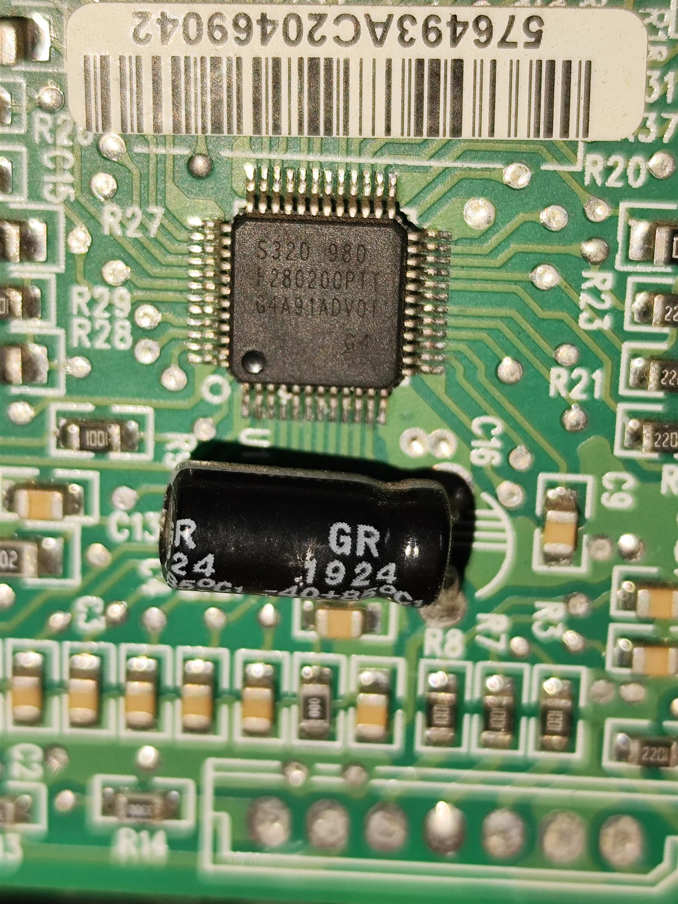
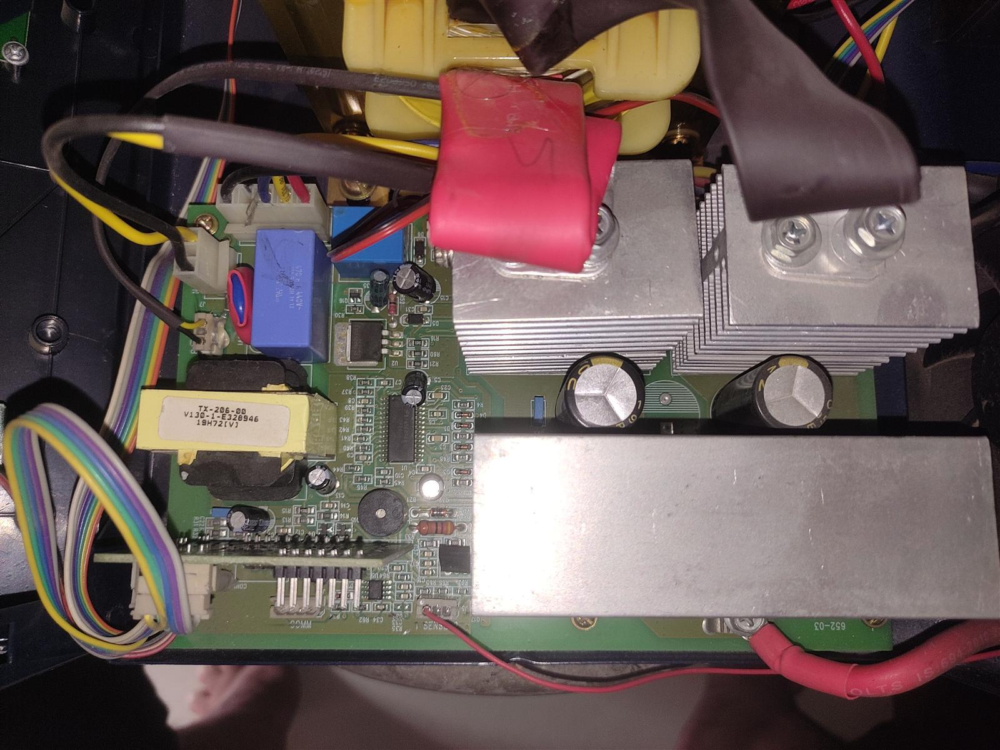
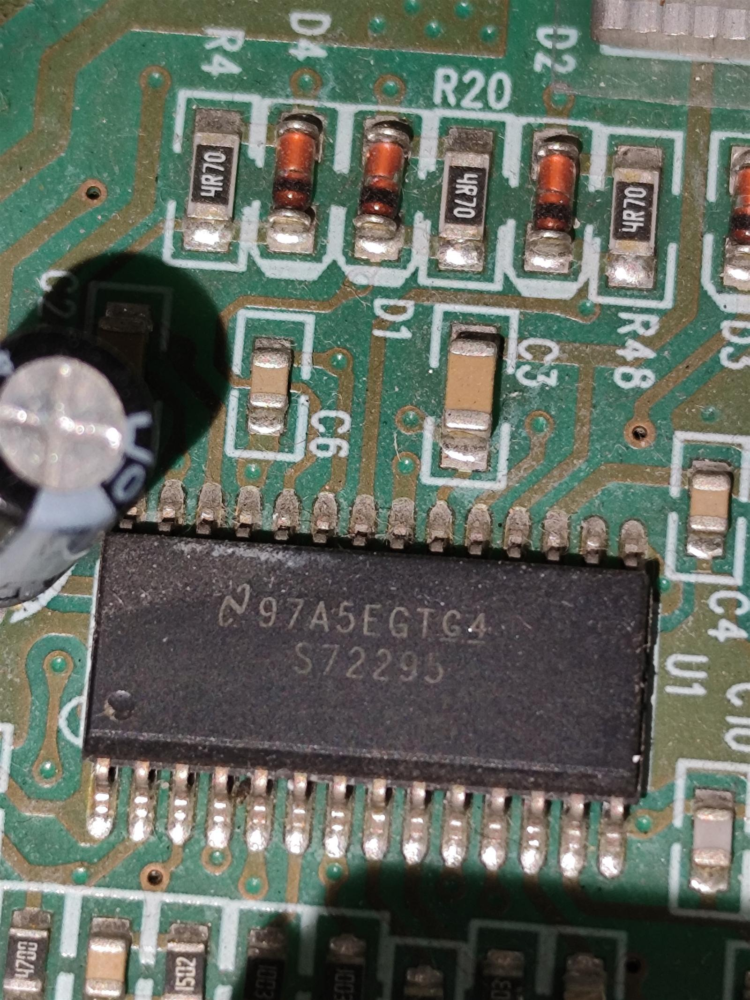
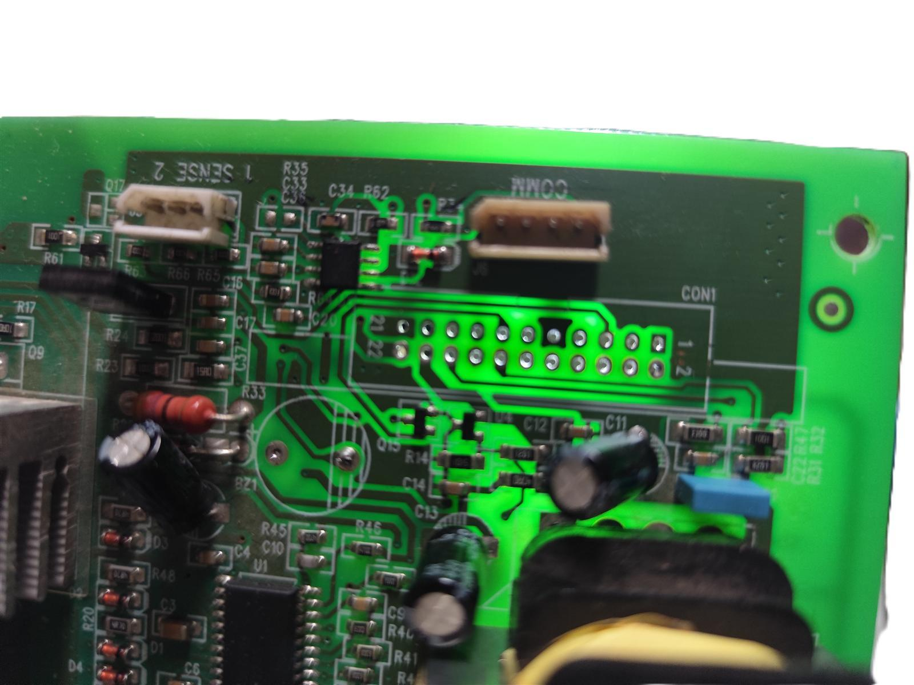
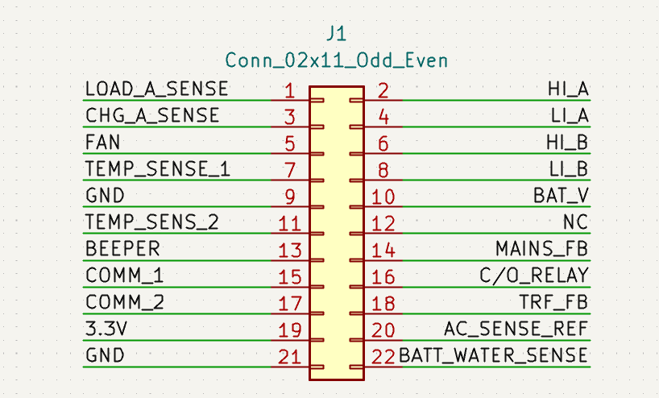
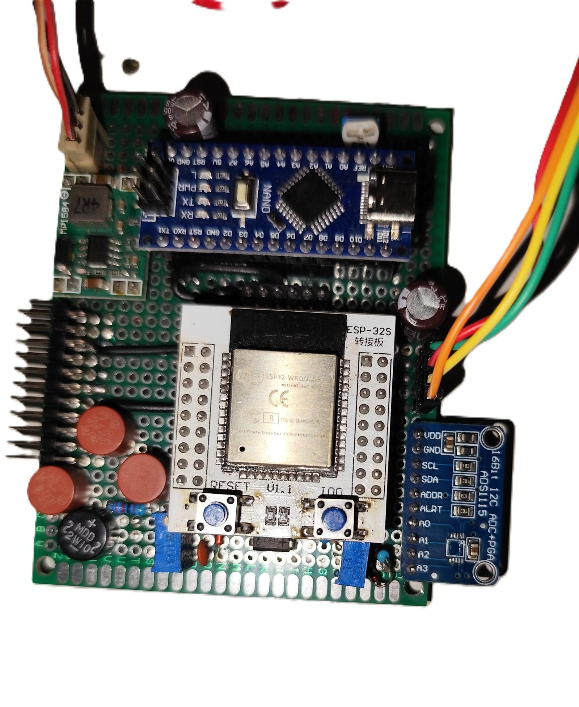
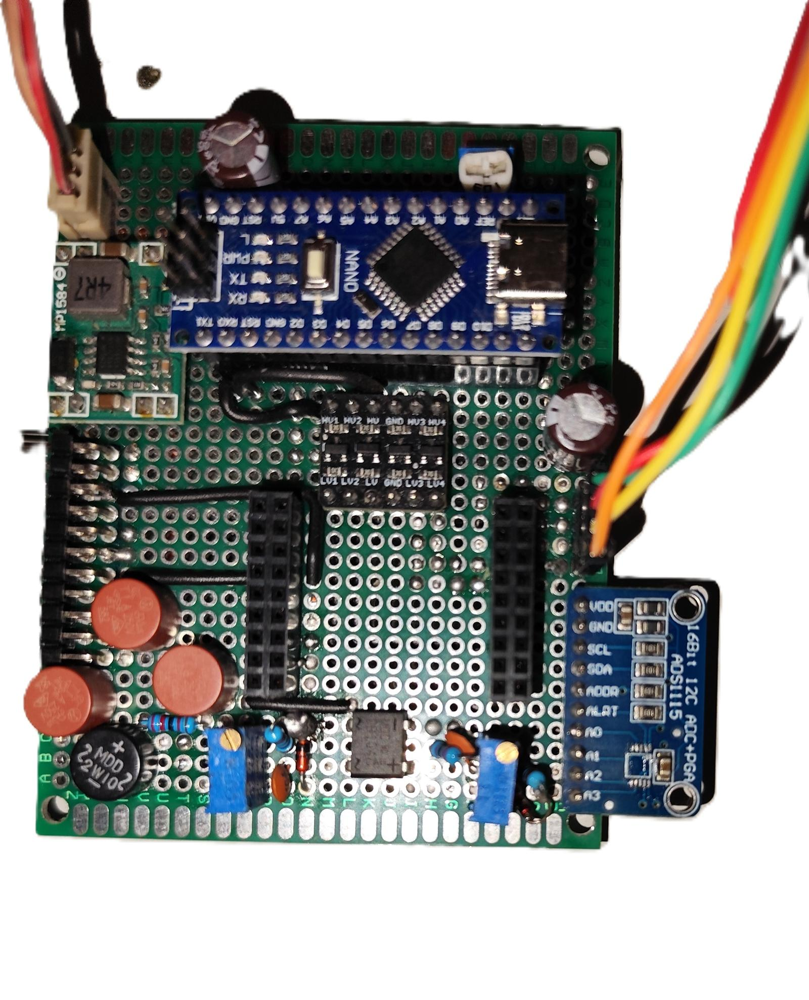
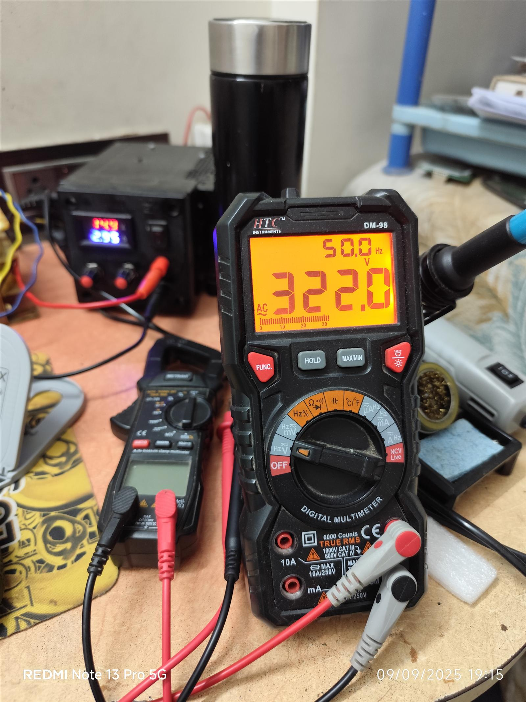
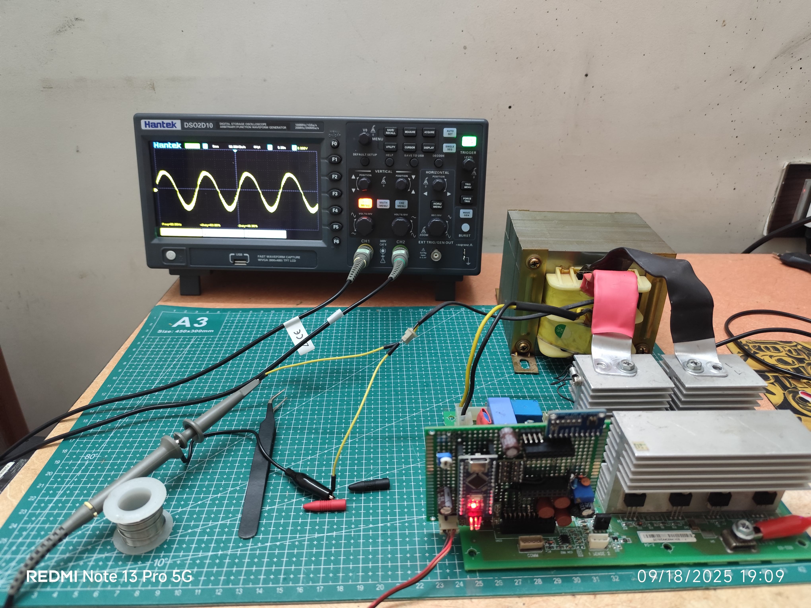

## Overview
I have noticed, that when power outages happen, I have no idea how much battery life is left in my inverter. I fee this is very much important to know, and so as to solve this, I completely redesigned the brain of the inverter using ESP32 platform. This system lets me monitor and control my power inverter remotely via WiFi, giving me real-time updates on battery status and power usage right on my phone, and some other metrics.

Truth be told, I wanted to turn my basic, "dumb" inverter into something much smarter. Instead of taking a walk down to the basement just to check the battery, I can now see everything I need right from my phone.

## Background 
Power cuts are a reality in many places, and inverters are our lifeline. But traditional inverters are dumb black boxes; they sit in a corner, humming away, until they suddenly die because the battery ran out. I wanted to change that.

My motivation came from a few practical needs:
- **Remote Monitoring:** I want to know the status without walking to it.
- **Battery Anxiety:** I want to know exactly how much juice is left so I wouldn't be waiting on the edge and counting it will die now... and now....
- **Control:** Being able to turn it ON/OFF remotely is a huge convenience.
- **Safety:** I want to add software limits, to protect the hardware. Which traditional inverters lack.

## Documentation Habits
Since my previous project, I have developed a habit of maintaining proper documentation. I took a ton of photos and videos of the internals for history and tracking. Trust me, you don't want to forget where that one red wire went.

## System Anatomy: What's Inside?
The original system was consisting of two main circuit boards. First, there's the **Core Baseboard**, which had power stage (MOSFETs), driver circuitry, transformers, and the peripheral interfaces. Then, attached vertically perpendicular, was the **Controller PCB**, which housed the DSP microcontroller & few other components.

  
  

## Strategy
I decided to keep the Baseboard **exactly as it is** and not modify it. My goal was to only redesign and replace the **Controller PCB**. 

By doing this, I would be able to universalize the design. Since most inverters in the Luminous series follow a nearly identical schematic for the baseboard (with only minor changes), my new smart controller could theoretically be plugged into almost any of their models, and it would work with no surprises.

## Disassembly
I started by completely tearing down the inverter, carefully disassembling every single part and removing every single connector. There was a 1cm thick layer of dust accumulated over years due to non-maintanance (typical of old inverters), so the first step was cleaning it up.

## Original Components

    

        
As i told before, the original controller is a <strong>Texas Instruments TMS320 F280x</strong> DSP microcontroller, which manages everything.

        
It was a "dumb" inverter indeed, and the design felt like a lesson in planned obsolescence. Every calibration and error parameter was hardcoded into the design, with zero potentiometers or headers for customization.

    

    

    

        
I also found the high-voltage driver section. The H-bridge controller, an <strong>S72295</strong> full-bridge driver IC, worked in tight conjunction with the DSP to manage the power switching.
        It directly takes 4 signals for the H bridge, and drives the mosfets in a bootstrap configuration.

    

    

## Tracing the Lines
To figure out how it all connected, I took a pen, paper, multimeter, and a flashlight. By shining the flashlight directly under (or above) the PCB, I could see the traces clearly through the board. This made reverse engineering the board significantly easier.

I am still working on completing the full schematic, but I have fully mapped out and understood the header pinout for the peripheral circuitry.

  
  

## Initial Testing
Before modifying anything, I powered it up. I then traced the PCB and noted down, at which pins what voltages are present. This led me to get an idea of how the inverter works. This is the first crucial step for hardware decode & debugging.

## Design Phase 1: Charging Control (The Scary Part)
This was the first technical topic I took charge of, because it was the most crucial. While being the case, it was also the easiest to mess up.

This phase was genuinely dangerous because it involved messing with direct **230V AC**. I connected a lead-acid battery directly to the mains via my circuit. If I messed something up in the code, or accidentally set the duty cycle to 100%, or due to loose wires or potentiometer fluctuations the duty fluctuated, it wouldn't just be an "oops." It would be <strong>catastrophic</strong>. It could either short the MOSFETs due to overcurrent or overcharge the battery, completely destroying it.

## How it Works: Boost-Shunting 
The inverter utilizes a topology known as the **Boost-Shunting Charge Method**. It sounds complex, but here are the technicalities:

In this setup, the transformer's primary winding (which has fewer turns) is actually used as an inductor. The secondary winding is connected to the Main AC input supply. Power is transferred from the secondary to the primary, using the transformer's **leakage inductance flux**. This energy is rectified through the H-bridge and then is used to charge the battery.

<video width="100%" controls>
  <source src="../../assets/projects/esp32-arduino-smart-inverter/charging.mp4" type="video/mp4">
</video>

### Charging Control
The key to getting this right is precise control. By controlling the **gate pulses**, more specifically their frequency and duty cycle, we can regulate the charging voltage.

We need to set a proper frequency to ensure the transformer core does **not saturate**. If the core saturates, the inductance drops to near zero, causing a dead short and blowing up the power stage instantly. The next video demonstrates the test setup and the results.
To safely develop and test this charging logic, I utilized an STM32's **timer** peripheral. 
I used it to create identical gate pulses for 2 outputs, giving me accurate control over frequency and duty cycle.
The video below demonstrates the working of the test setup of the charging circuit.

<video width="100%" controls>
  <source src="../../assets/projects/esp32-arduino-smart-inverter/stm_charging_test.mp4" type="video/mp4">
</video>

*Fun fact: This was actually a sub-project(Intro to Timer Peripheral) from my internship work that was going on side-by-side. I implemented that logic here for my convenience!*

## Charging Test Verdict
The system worked as intended. This was the signal to move on to the main event: building the physical controller. But before that:

I have to admit, I have a bit of a weird habit. I tend to dive into the practical side first rather than spending hours drawing perfect schematics. Usually, the schematic is already built in my head, and I just implement it. I know it breaks every "standard practice" rule in the book, and I am trying to change, but it has its perks. I see the consequences immediately. For example, shorted traces, wrong values, real-world situations, etc. rather than finding them out weeks later.

## Design Phase 2: The Controller PCB

### Design Thinking
My first thought was to do everything on the ESP32. But then I decided no, this is not the right way. I chose to offload the safety-critical task of **Sine Wave Generation** to an **Arduino Nano**. The ESP32 would act as the Master Controller, dictating the Nano via UART communication.

### The Math Behind the Wave
I started digging around for pure sine wave generation techniques on the Arduino Nano. I found a fantastic resource where the creator explained the complex math behind generating a **tri-level sine wave**. I took his concept and modified the code to fit my specific requirements.
Specifically, I needed precise control over **wave modulation** functionality that wasn't present in the raw implementation. I added these features to ensure the inverter could alter the sine wave function with change in load.

The core logic for the wave generation is based on this awesome video:

[Original Creator's Version](https://www.youtube.com/watch?v=KDor-6jGp0o)

### Hardware Implementation
Then came the physical build. I started soldering components onto a zero PCB, adding parts piece by piece.

<video width="100%" controls>
  <source src="../../assets/projects/esp32-arduino-smart-inverter/hardware_soldering.mp4" type="video/mp4">
</video>

I mounted the Arduino Nano and the ESP32, slowly turning this piece of zeroboard into a intelligent-FR4 (pun intended!)

  
  

### Controller Technicalities
For those interested in the geeky details, here are my notes and pinout configurations used for the custom controller:

| Pin Connection | Description |
| :--- |  :--- |
| **Arduino TX** → **ESP32 GPIO 16** | UART Ch1 (Thru Level Shifter) |
| **Arduino RX** ← **ESP32 GPIO 17** | UART Ch2 (Thru Level Shifter) |
| **Arduino D8** → **ESP32 GPIO 23** | CHG_EN (Charge Enable) |
| **Arduino D7** → **ESP32 GPIO 22** | INV_EN (Inverter Enable) |
| **ESP32 GPIO 26** | Buzzer Output |
| **ESP32 GPIO 25** | Fan Control (PWM) |
| **ESP32 GPIO 35** | Battery Voltage Sense (Analog) |
| **ESP32 GPIO 13** | Changeover (C/O) Relay Control |
| **ESP32 GPIO 39** | Temperature Sensor (NTC) |

**ADC Configuration (ADS1115):**
The ESP32 uses an external I2C ADC (ADS1115) for high-precision measurements.
*   **SDA:** GPIO 18
*   **SCL:** GPIO 19
*   **A0:** Battery Charging Current
*   **A1:** Inverter Load Current
*   **A2:** AC Voltage Feedback
*   **A3:** Mains Presence Voltage

> **⚠️ CRITICAL WARNING:**
> DO NOT remove the control card while the **12V rail is active**. This leads to immediate **Full Bridge Driver DEATH**. (And yes, that chip is expensive).

**System Constants:**
*   **Battery Voltage Range:** 10V (1.67V at ADC) - 14.4V (2.413V at ADC)
*   **Temp Sensor:** ~1.622V at Room Temp (28°C). Voltage *decreases* as temperature *increases* (NTC behavior).
*   **Relay Logic:** LOW = Mains Bypass/Charging Mode. HIGH = Inverter Mode.

### The "Smoke Test"
The first time I flipped the switch, the ESP32 blew up straight away.

The issue turned out to be the onboard regulator. It was not able to sustain the spike on 3.3V line, when the output was turned ON. My fix was to add an **MP1584 module** to step down the 12V battery voltage directly to a stable 3.3V specifically for the ESP32.

    

        
I fired it up again. Nothing blew up! But due to some mismatch in component values, the output voltage was super off, generating around <strong>322V AC</strong>. Alright, time for some calibration.

    

    

## Sine Generation Test
After the hardware was built and appropriate voltages were present, I loaded the first simple inverter generation code. It was just a raw test to see if it could generate controlled AC waveform as intended.

<video width="100%" controls>
  <source src="../../assets/projects/esp32-arduino-smart-inverter/inverter_test.mp4" type="video/mp4">
</video>

## The Firmware & Hardware Issues
Once the hardware design was completed and all set, i moved to firmware.
This was a real deal here since it wouldn't be a simple game.

But hardware development is never a straight line. During this phase, the **H-bridge driver IC (S72295)** blew up not once, but **three times**. You may ask the culprit, it was an intermittent ground connection that sometimes went floating, completely messing up the reference point.

Oh, and I also forgot to mention: shortly after the ESP32 sacrifice, during the 2nd prototype test with a 7AH lead-acid battery, the **two low-side N-channel MOSFETs** decided to blow up. Just another day in the lab.

## Design Phase 3: Load Testing & Feedback
Leaving the past behind, I moved to test the inverter's load capabilities and feedback control. I set up a complex rig involving a controlled load, the lead-acid battery, and a mess of measurement equipment.

<video width="100%" controls>
  <source src="../../assets/projects/esp32-arduino-smart-inverter/load_reg_test.mp4" type="video/mp4">
</video>

Despite the earlier chaos, the inverter actually behaved well. The **transient load response** was surprisingly fast, and the UART communication between the ESP32 and Nano was surprisingly stable.

## Design Phase 4: Telemetry & Dashboard
The final part was making it 'Smart'. I worked on implementing a custom dashboard using HTML/CSS/JS Stack. It's a full featured interface which can control and monitor the inverter. It also embeds a calibration interface to fine tune the ADC to get accurate voltage and current values.

For the Dashboard Development, we are currently at **Stable V1**. It's technically still a beta version with some known bugs, but it works and is open to development.

<video width="100%" controls>
  <source src="../../assets/projects/esp32-arduino-smart-inverter/dashboard.mp4" type="video/mp4">
</video>

## Waveform Analysis
These are the waveforms captured on the oscilloscope, showing the tri-level sine wave generation and the output filtering.

  
  <video width="50%" controls>
    <source src="../../assets/projects/esp32-arduino-smart-inverter/spwm_osc.mp4" type="video/mp4">
  </video>

## Feedback Logic: Closing the Loop
Stable voltage output requires a solid feedback mechanism. Here is the testing of the voltage feedback loop, ensuring the system responds to output load changes.

<video width="100%" controls>
  <source src="../../assets/projects/esp32-arduino-smart-inverter/voltage_feedback.mp4" type="video/mp4">
</video>

## Communication Protocols
The ESP32 and ADS1115 Sensor communication is critical, so I captured the I2C dataframes for verification and they look proper and neat.
Also checked and verified the UART data transfer between ESP32 and Arduino Nano.

  <video width="50%" controls>
    <source src="../../assets/projects/esp32-arduino-smart-inverter/i2c_dataframe.mp4" type="video/mp4">
  </video>
  <video width="50%" controls>
    <source src="../../assets/projects/esp32-arduino-smart-inverter/comm_test.mp4" type="video/mp4">
  </video>

## Final Integration Tests
With this, the first final stable version of the project was completed. It's currently pending copyright approval, and i am completing the documentation for it. 

<video width="100%" controls>
  <source src="../../assets/projects/esp32-arduino-smart-inverter/final_test_1.mp4" type="video/mp4">
</video>

## Documentation & Resources
The whole code is pushed onto [github](https://github.com/atharvap8/ESP32-Arduino-Smart-Inverter).

In the github Repo, you'll find a folder called docs, where there are 5 files:

- **css-structure.txt**: Explains the stylesheet architecture and class naming conventions for the web dashboard.
- **dataflow-structure.txt**: Details the complete data path from hardware sensors through the ESP32 to the web interface.
- **html-structure.txt**: Outlines the DOM structure, semantic elements, and component hierarchy of the frontend.
- **js-structure.txt**: Documentation for the client-side JavaScript, including WebSocket handling and UI updates.
- **program-structure.txt**: A high-level overview of the firmware architecture for both the ESP32 and Arduino Nano.
- **startup.txt**: The initialization sequence and boot process documentation for the inverter system.

Rest for the hardware part, i will soon upload the schematics, PCB Layout Designs, and docs, if any.
Stay Tuned!

## Conclusion
This journey from a "dumb" black box to a smart, connected device was a rollercoaster of burnt silicon and eureka moments. I have successfully reverse-engineered the standard inverter configuration and built a drop-in replacement controller that adds modern IoT capabilities.

While there are still bugs to fix and efficiency to squeeze out, the **Stable Prototype V1** is live and running. Next step: Universalizing the PCB design for mass compatibility.

