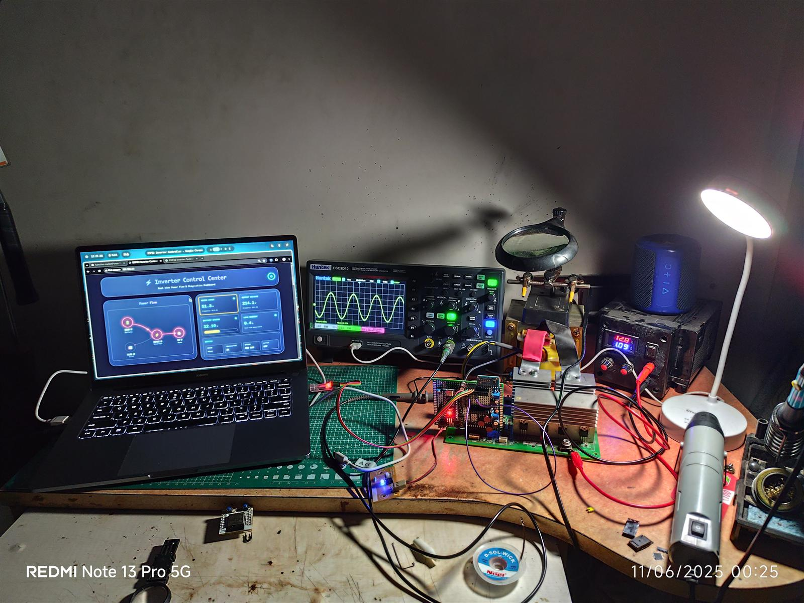

### Overview
I have noticed, that when power outages happen, I have no idea how much battery life is left in my inverter. To solve this, I completely redesigned the brain of the inverter using the ESP32 platform. This system lets me monitor and control my power inverter remotely via WiFi, giving me real-time updates on battery status and power usage right on my phone, and some other metrics.

I wanted to turn my basic, "dumb" inverter into something much smarter. Instead of taking a walk down to the basement just to check the battery, I can now see everything I need right from my phone.



### Background 
Power cuts are a reality in many places, and inverters are our lifeline. But traditional inverters are dumb black boxes; they sit in a corner, humming away, until they suddenly die because the battery ran out. I wanted to change that.

My motivation came from a few practical needs:
- **Remote Monitoring:** I want to know the system status without physically inspecting it.
- **Battery Anxiety:** I want to know exactly how much juice is left so I wouldn't be waiting on the edge and counting it will die now... and now... and now.....
- **Control:** Being able to turn it ON/OFF remotely is a huge convenience.
- **Safety:** I want to add software limits. to protect the hardware. Which 

### The Problem with Old Inverters
Traditional inverters are sturdy but stupid. Dealing with them brought up several annoyances:

- **Lack of Visibility**:
There's simply no way to check the battery status or inverter state without walking up to the device. If it's in a hard-to-reach spot or, on top of shelf, you're doomed.

- **Manual Operation Guidelines**:
Switching the inverter ON or OFF requires physical access. In an emergency, or just when you're lazy, this is a pain point.

- **No Power Insights**:
You don't get to see  or know how much energy you are consuming. I intended to fix that.

- **Limited Safety Features**:
While they have basic fuses, they lack intelligence. I wanted a system that could preemptively predict battery life wear and act accordingly, not just worsen it up.

This project is my answer to these limitations. A smart, connected controller that takes existing hardware and gives it a smart brain.

---

## Disassembling the Beast
I started by completely stripping down the inverter, carefully disassembling every single component and wire. It was messy, so the first order of business was clearing off the layers of dust.

## Documentation Habits
Since my previous project, I've built a strong habit of maintaining proper documentation. I took a ton of photos and videos of the internals for history and tracking. Trust me, you don't want to forget where that one red wire went.

## Reverse Engineering the Brain
Then came the deep dive. I identified the original controller as a **Texas Instruments TMS320 F280x** DSP microcontroller, which single-handedly managed everything.


It was a "dumb" inverter indeed, and the design felt like a lesson in planned obsolescence. Every calibration and error parameter was hardcoded into the design, with zero potentiometers or headers for customization.

I also found the H-bridge controller, an **S72295** full-bridge driver IC, which worked in conjunction with the DSP.


## Tracing the Lines
To figure out how it all connected, I grabbed a pen, paper, multimeter, and a flashlight. By shining the flashlight distinctively under (or above) the PCB, I could see the traces clearly through the board. This made reverse engineering the schematic significantly easier.

I am still working on completing the full schematic, but I have fully mapped out the header pinout.


## Initial Testing
Before modifying anything, I powered it up and probed the board to map out where the key voltages were present. I logged every reading and observation into Google Keep—my second brain for these projects.

---

## Building the Hardware
Connecting the ESP32 was mostly straightforward, but I had to be careful with the voltage levels. The ESP32 is a 3.3V device, but the inverter runs on a car battery (12V).

### Wiring the Brain
I used specific GPIO pins to avoid conflicts with the boot process.
*   **Relays on GPIO 4 & 5:** These control the main power.
*   **Sensors on GPIO 34 & 35:** These are input-only pins, perfect for analog sensors.

### The Power Challenge
Since the battery can go up to 14.4V while charging, and the ESP32 can only handle 3.3V, I built a voltage divider.
`Vout = Vin * (R2 / (R1 + R2))`
Using a 47kΩ and 12kΩ resistor gave me a safe measurement range up to 15V. For powering the board itself, the buck converter steps the 12V down to a stable 5V.

### Wired for Safety
I didn't want to fry anything, so I added:
*   **Optocouplers** on the relay module to isolate the high-voltage switching from the microcontroller.
*   **Fuses** on the main input line.
*   **Decoupling capacitors** to filter out electrical noise.

---

## Writing the Firmware
I wrote the firmware using the **Arduino IDE**. Instead of a single monolithic file, I structured the code into specific tasks:
1.  **Keep Connected:** The ESP32 constantly checks WiFi. If it drops, it reconnects automatically.
2.  **Read & Report:** Every 2 seconds, it reads the voltage, current, and temperature, then pushes that data to Blynk.
3.  **Listen:** It listens for command packets from the app (like "Turn OFF") and triggers the relays immediately.

### Key Logic Snippets
The core logic revolves around specific tasks. For example, here is how the system checks the battery level and decides if it needs to shut down:

```cpp
void checkBatteryLevel() {
  float voltage = readBatteryVoltage();
  
  // Auto-shutdown if critical
  if (voltage < 10.8 && inverterStatus) {
    setInverterState(false);
    Blynk.logEvent("low_battery", "Critical Battery: Inverter Shutdown");
  } 
}
```
This simple check runs every few seconds and has already saved my battery from deep discharge twice!

## The Dashboard
I didn't want to spend weeks building a custom app, so I used the **Blynk IoT platform**. It gave me a professional-looking dashboard where I can:
*   See the battery voltage in real-time.
*   Get push notifications if the system overheats.
*   Turn the inverter ON/OFF from anywhere in the world.


## Challenges & Solutions

### 1. The Voltage Divider Headache
Getting accurate voltage readings was harder than I expected. My first voltage divider circuit was affecting the measurements because of high impedance. I had to lower the resistor values and add a capacitor to smooth out the noise.

### 2. Noisy Current Readings
The inverter creates a lot of electrical noise when it switches. My current sensor was picking up all this interference, showing ghost currents even when nothing was running. I solved this by moving the sensor further away and adding a software filter to average out the spikes.

## What's Next?
Right now, the system works great for monitoring. In the future, I want to add:
*   **Solar Integration:** To see how much power my solar panels are generating.
*   **Voice Control:** "Alexa, turn on the inverter" would be pretty cool.
*   **Data Logging:** Saving long-term data to SD card to track battery health over months.

This project took my dumb inverter and made it a smart member of my home. Its reliability has been a game changer for my daily life.


