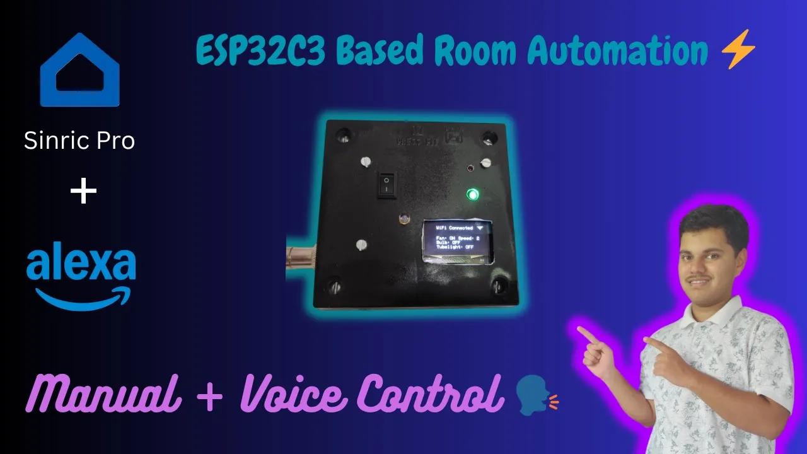

## Introduction
This project is a DIY smart room automation controller built using the ESP32-C3 microcontroller on a custom-designed PCB. The system allows control of up to three appliances through multiple interfaces - Alexa voice commands, IR remote, and manual wall switches. It features a compact enclosure with a small OLED display for real-time status monitoring.

The custom PCB was designed in EasyEDA and hand-assembled, making this a complete end-to-end embedded systems project from schematic design to firmware development.



## Features
- **Voice Control**: Alexa integration via Sinric Pro for hands-free operation
- **IR Remote Support**: Use any IR remote to control appliances
- **Manual Switches**: Physical switches for traditional control
- **Three Relay Outputs**: Control lights, fans, or any AC appliance
- **Real-time Status Display**: Small OLED display shows current state of all devices
- **OTA Updates**: Firmware upgradeable over-the-air
- **Compact Design**: Custom PCB in a small enclosure

## Components Required
- ESP32-C3 Development Board / Module
- 3-Channel Relay Module (5V)
- IR Receiver Module (TSOP1738 or similar)
- 0.96" OLED Display (I2C)
- Toggle/Rocker Switches (3x)
- 5V Power Supply / Buck Converter
- Screw Terminals
- Custom PCB (designed in EasyEDA)
- Enclosure
- Jumper Wires and Connectors

## System Architecture

The system uses the ESP32-C3 as the main controller, which manages:
1. **WiFi Communication**: Connects to home network for Alexa/Sinric Pro integration
2. **IR Decoding**: Receives and processes IR commands from remotes
3. **Switch Input**: Monitors physical switch states with debouncing
4. **Relay Control**: Drives three relay channels for appliance control
5. **Display Updates**: Shows real-time status on OLED

```
┌─────────────────────────────────────────────────────────────┐
│                      ESP32-C3 CONTROLLER                     │
│  ┌─────────────┐  ┌──────────────┐  ┌──────────────┐       │
│  │WiFi Module  │  │  GPIO Pins   │  │  I2C Bus     │       │
│  │ (Sinric)    │  │ (Switches/   │  │  (OLED)      │       │
│  │             │  │  Relays/IR)  │  │              │       │
│  └─────────────┘  └──────────────┘  └──────────────┘       │
└─────────────────────────────────────────────────────────────┘
        ↓                    ↓                     ↓
┌──────────────┐   ┌──────────────────┐   ┌────────────────┐
│ Alexa / App  │   │  Relay Module    │   │  OLED Display  │
│ (Voice Ctrl) │   │  (3 Channels)    │   │  (Status)      │
└──────────────┘   └──────────────────┘   └────────────────┘
                           ↓
                   ┌──────────────────┐
                   │  AC Appliances   │
                   │  (Light/Fan/etc) │
                   └──────────────────┘
```

## How It Works

### Voice Control (Alexa via Sinric Pro)
The ESP32-C3 connects to WiFi and communicates with the Sinric Pro cloud service. When you say "Alexa, turn on the light", Alexa sends the command to Sinric Pro, which forwards it to the ESP32-C3. The firmware then activates the corresponding relay.

### IR Remote Control
An IR receiver module captures signals from any IR remote. The firmware decodes the signal and maps specific buttons to relay actions. This allows repurposing old TV remotes for home automation.

### Manual Switch Control
Physical toggle switches provide traditional control. The firmware continuously monitors switch states and toggles relays accordingly, with proper debouncing to prevent false triggers.

### OLED Status Display
A small 0.96" OLED display shows:
- WiFi connection status
- State of each relay (ON/OFF)
- Current IP address
- Error messages if any

## Software Implementation

### Development Environment
- Arduino IDE with ESP32-C3 board support
- Required Libraries:
  - SinricPro (Alexa integration)
  - IRremoteESP8266 (IR decoding)
  - Adafruit_SSD1306 (OLED display)
  - WiFi (built-in)

### Key Code Structure

```cpp
#include <WiFi.h>
#include <SinricPro.h>
#include <SinricProSwitch.h>
#include <IRremoteESP8266.h>
#include <IRrecv.h>
#include <Adafruit_SSD1306.h>

// Pin Definitions
#define RELAY_1 2
#define RELAY_2 3
#define RELAY_3 4
#define SWITCH_1 5
#define SWITCH_2 6
#define SWITCH_3 7
#define IR_RECV_PIN 8

// Device IDs from Sinric Pro Dashboard
#define DEVICE_ID_1 "your_device_id_1"
#define DEVICE_ID_2 "your_device_id_2"
#define DEVICE_ID_3 "your_device_id_3"

void setup() {
  // Initialize pins
  pinMode(RELAY_1, OUTPUT);
  pinMode(RELAY_2, OUTPUT);
  pinMode(RELAY_3, OUTPUT);
  
  // Initialize WiFi
  WiFi.begin(ssid, password);
  
  // Initialize Sinric Pro
  setupSinricPro();
  
  // Initialize IR receiver
  irrecv.enableIRIn();
  
  // Initialize OLED
  display.begin(SSD1306_SWITCHCAPVCC, 0x3C);
}

void loop() {
  SinricPro.handle();
  handleIRRemote();
  handleManualSwitches();
  updateDisplay();
}
```

## PCB Design

The custom PCB was designed in EasyEDA with the following considerations:
- **Compact Form Factor**: Fits in a standard electrical junction box
- **Isolation**: Proper separation between high-voltage relay traces and low-voltage logic
- **Mounting Holes**: Compatible with standard enclosure mounting
- **Terminal Blocks**: Easy wire connections for AC loads
- **Test Points**: For debugging during development

### PCB Features
- 2-layer design
- Integrated relay footprints
- USB-C connector for programming
- Status LEDs for each channel
- Reset and boot buttons

## Assembly & Installation

### Step 1: PCB Assembly
1. Solder all SMD components first (resistors, capacitors)
2. Add the ESP32-C3 module
3. Install relay modules
4. Connect terminal blocks
5. Add the OLED display connector

### Step 2: Enclosure Preparation
1. Drill holes for switches and display
2. Mount the PCB inside
3. Wire the AC connections carefully
4. Ensure proper insulation

### Step 3: Firmware Upload
1. Connect via USB-C
2. Select ESP32-C3 Dev Module in Arduino IDE
3. Upload the firmware
4. Configure WiFi credentials

### Step 4: Sinric Pro Setup
1. Create account at sinric.pro
2. Add three switch devices
3. Copy device IDs to firmware
4. Link with Alexa app

## Safety Considerations

⚠️ **WARNING**: This project involves working with mains AC voltage (220V/110V).
- Always disconnect power before working on the circuit
- Use proper insulation and enclosure
- Ensure relay ratings match your load requirements
- Follow local electrical codes and regulations
- Consider hiring a licensed electrician for installation

## Advantages
- Multiple control options (voice, IR, manual)
- No cloud dependency for local control
- OTA updates for easy maintenance
- Compact custom PCB design
- Cost-effective DIY solution
- Works with existing switches

## Disadvantages
- Requires WiFi for voice control
- Initial setup can be complex
- Working with mains voltage requires caution
- Limited to 3 devices per unit

## Future Improvements
- Add more relay channels (up to 8)
- Integrate with Home Assistant
- Add scheduling functionality
- Implement energy monitoring
- Design a mobile app for local control
- Add support for Google Home
- Implement mesh networking for multiple units

## Conclusion
This ESP32-C3 based room automation controller demonstrates how a compact, feature-rich smart home device can be built with off-the-shelf components and a custom PCB. The combination of Alexa voice control, IR remote support, and manual switches provides flexibility for all users, while the OLED display offers at-a-glance status information.

The project showcases skills in PCB design, embedded firmware development, cloud IoT integration, and practical home automation implementation.
